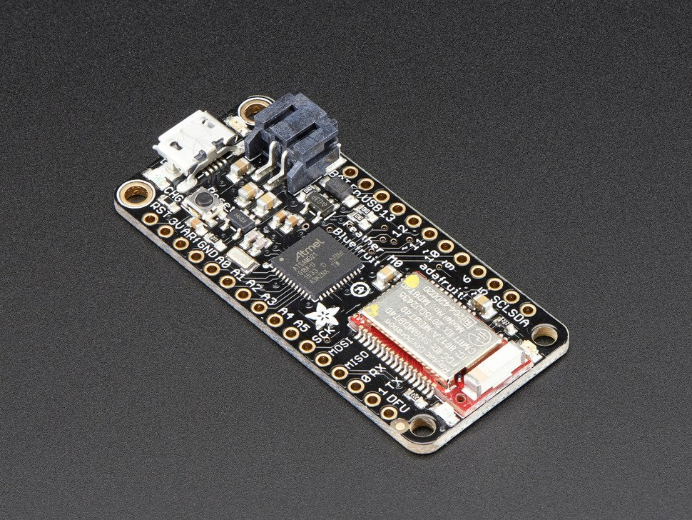
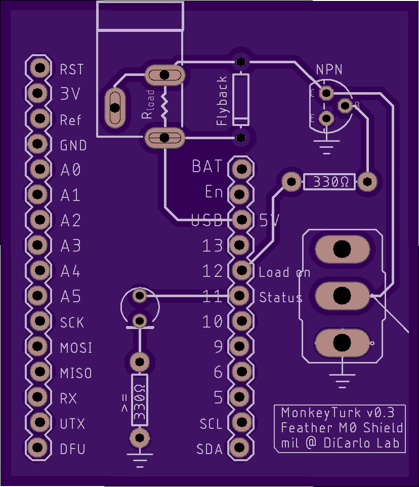
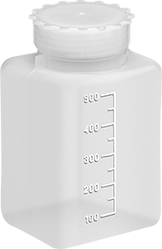

### Parts list for the bluetooth juicer 

- Microcontroller with Bluetooth capabilities: [Adafruit Feather M0 Bluefruit LE](https://www.adafruit.com/product/2995)

    

- Fluid pump: [TCS Micropumps D250S-L-SV](https://micropumps.co.uk/TCSD200Lrange.htm).
    - Model ID: D250S-L-SV
    - Diaphragm pump (not a peristaltic one, which would be more hygienic / cheaper - but I haven't found a precise enough peristaltic one yet)
    - Cost: 89.5 GBP
    
- In-house PCB design for FeatherB0
    - Ready to order off-the-shelf from [OshPark](https://oshpark.com/shared_projects/wfkguyRQ) @ $15.90 per board
    - The (.brd) file is [here](bluetooth_juicer/bluetooth_juicer_shield_pcb_design.brd)
        
    
- Electronics parts
    - [Transistor - NPN, 50V 800mA (BC337)](https://www.sparkfun.com/products/13689)
    - [Toggle Switch](https://www.digikey.com/product-detail/en/carling-technologies/2M1-SP2-T1-B1-M2QE/432-1170-ND/668386)
    - [DC Barrel Jack](https://www.sparkfun.com/products/10811)
    - [Break away male headers](https://www.sparkfun.com/products/116). In total you need 28 pins for a single device. 
    - [Cuttable female headers](https://www.sparkfun.com/categories/381). In total, for a single device, you need a 12-pin header, and a 16-pin header. The linked product can be cut, but there are also pre-cut ones available.
    - [Diode](https://www.sparkfun.com/products/116)
    - [LED](https://www.sparkfun.com/products/12062). Recommended but optional; used for debugging.
    - x2 [330 Ohm resistor](https://www.sparkfun.com/products/8377). 2 are recommended, but you need at least 1 per device. 
    - [Male pigtail cables](https://www.amazon.com/iMBAPrice-iMBA-CCTV-PGTM-10-Security-Camera-Pigtail/dp/B0054D80LE/)
 
 - Battery with "Always On" design: [Voltaic Systems V50 USB Battery Pack](https://voltaicsystems.com/v50/)
    - Voltaic Systems makes external battery packs with [what they call "Always On" mode](https://voltaicsystems.com/always-on-batteries/): 
        
        `Always On means that the output of the battery or power bank does not shut off after a set amount of time. There is no low current shutoff. It stays on.`
    - The Bluetooth juicer draws low current only sporadically. Many batteries automatically shut-off under this regime, as a power saving feature. A battery which does not do this is needed (like the one linked above).  
    
### Box parts 

- Food safe silicon tubing which fits the fluid pump
- One-liter water bottle: [McMaster-Carr Graduated HDPE Plastic Jar 950 ml Capacity (Style B) #41665T26](https://www.mcmaster.com/catalog/127/1875)

    
